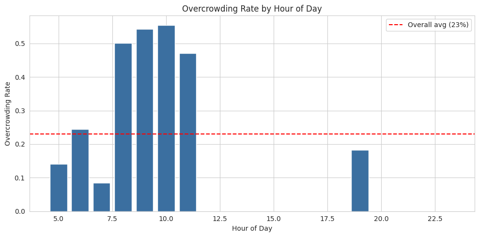
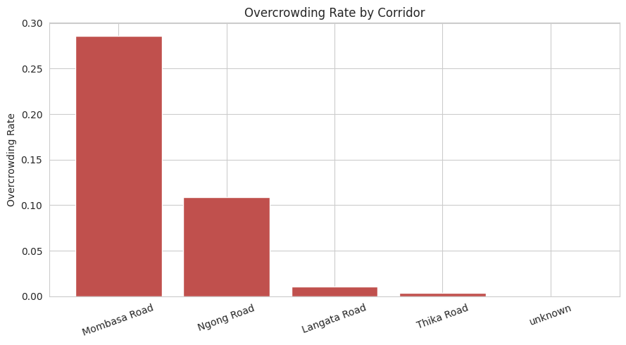
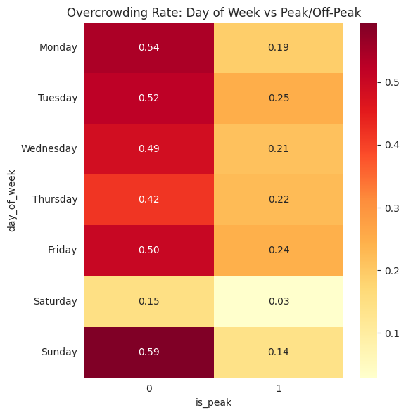
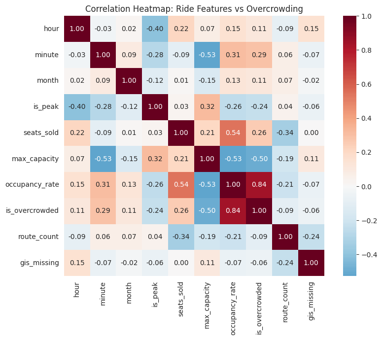
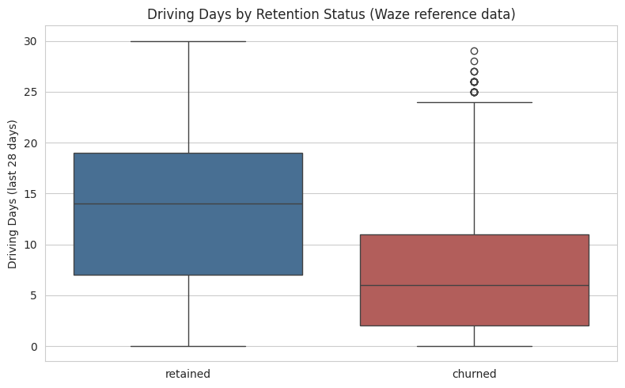

# MataPredict

MataPredict predicts whether a matatu ride into Nairobi will be overcrowded. A ride counts as overcrowded when 80% or more of its seats are sold.

**Live app:** [Streamlit Deployment](https://matapredict-5seiycsqmwbumdomwionkh.streamlit.app/)

## What the project does
Matatu passengers and operators cannot easily tell in advance which rides will be packed. This project uses past ticket sales to learn when and where overcrowding happens. Given the town of origin, the time of day, the day of the week, the month, the vehicle type and the payment method, the model gives the chance that a ride will be overcrowded.

The app has two tabs:
- **Predict a ride:** choose the ride details and get the chance of overcrowding.
- **Explore the data:** see how overcrowding changes by hour and by corridor.

## Data
| Data | Source | Used for |
|---|---|---|
| Matatu ticket data | [Zindi: Traffic Jam, Predicting People's Movement into Nairobi](https://zindi.africa/competitions/traffic-jam-predicting-peoples-movement-into-nairobi/data) | Rides, times, vehicle types and the overcrowding target |
| Route and stop map data | [Digital Matatus project](https://digitalmatatus.com/) | Corridor labels and map positions |
| Waze user data | [Waze App User Dataset](https://www.kaggle.com/datasets/likhari/waze-user-dataset) | Background reference only |

The raw files are not stored in this repo. Download them from the sources above.

## How it works
1. The ticket data has one row per ticket. We group it into one row per ride and count the seats sold.
2. We calculate the share of seats filled. A ride at 80% or more is labelled overcrowded.
3. We add time features (hour, day, month, peak hour) and a corridor label for each origin town.
4. We train two models, Logistic Regression and a Decision Tree, and compare them.
5. The Decision Tree is saved and used in the app.

The full steps, with explanations, are in the notebook

## What we found
The dataset has 6,249 rides. About 23% of them are overcrowded.

### Overcrowding by hour of day
Overcrowding is not spread evenly across the day. The chart shows the share of overcrowded rides for each hour. The red line is the overall average.



### Overcrowding by corridor
Mombasa Road has the highest share of overcrowded rides. Ngong Road is lower, and Langata Road and Thika Road are close to zero.



### Day of the week and peak hours
This grid shows overcrowding for each day, split into off-peak and peak hours.



### How the columns relate to overcrowding
This heatmap shows which columns move together with overcrowding.



### Waze reference chart
This chart uses a separate Waze app dataset. It is not about matatus. It is included only as background.



## Model results
Scores on the held-out test rides:

| Model | Accuracy | Precision (overcrowded) | Recall (overcrowded) | F1 (overcrowded) |
|---|---|---|---|---|
| Logistic Regression | 0.79 | 0.53 | 0.94 | 0.67 |
| Decision Tree | 0.81 | 0.56 | 0.95 | 0.70 |

The Decision Tree finds about 95% of the truly overcrowded rides. It also gives some false alarms: when it says a ride will be overcrowded, it is right about 56% of the time.

## Assumptions and limits
- **Corridor mapping is an assumption.** The Zindi data records the origin town but not the road used to enter Nairobi. We assigned each town to a corridor ourselves. For example, Kisii and Migori are assigned to Mombasa Road. Because most origin towns were assigned to Mombasa Road, it holds most of the rides, and the corridor results depend heavily on this choice. Treat them as indicative, not exact.
- **Overcrowded means 80% full.** This cut-off was our choice. A different cut-off would change the results.
- **Random test split.** The test rides were picked at random from all dates, so the scores may be higher than on future rides. The notebook includes a second test on the latest rides to check this.
- **Limited data.** The data covers a limited period and a small set of origin towns, so the model may not work well for other routes.
- **The Waze data is not about matatus.** It is background only.

## Run it yourself
```
pip install -r requirements.txt
streamlit run app.py
```

## Repo contents
| File | What it is |
|---|---|
| `app.py` | The Streamlit web app |
| `model.pkl` | The trained Decision Tree |
| `model_columns.json` | The columns the model expects |
| `model_meta.json` | The scikit-learn version used to train the model |
| `requirements.txt` | Python packages needed to run the app |
| `notebooks/` | The Colab notebook with all the steps |
| `images/` | Charts used in this README |
